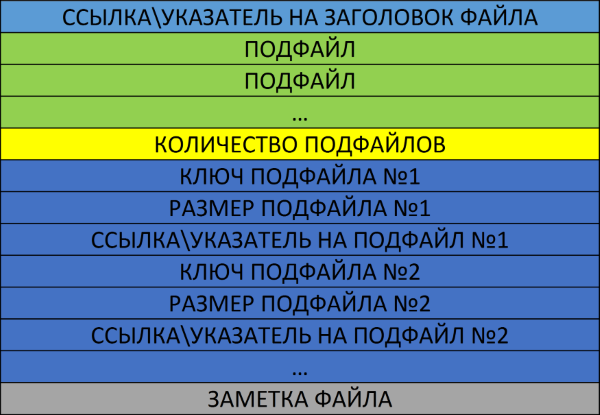

# xquotes_history
С++ header-only библиотека для хранения котировок

## Описание

* Данная библиотека позволяет хранить котировки в сжатом формате.
Для сравнения: csv файлы более 20 валютных пар с большой глубиной истории занимают 10.9 Гб на жестком диске.
Формат qhs4 (формат библиотеки, в котором используется цены бара без объема) без использования сжатия занимает 5.52 Гб, а при использовании сжатия 932 Мб!
Таким образом в данном случае формат qhs4 занимает в 11.97 раз меньше места, сохраняя при этом 5-ти значные котировки без потерь!
* Библиотека обеспечивает удобный доступ к историческим данным и позволяет получать простой доступ к любой цене по метке времени.
Библиотека имеет два класса для считывания qhs* файлов (для доступа к одному файлу или для одновременного использования нескольких файлов)
При этом чтобы получить интересующую вас цену достаточно указать метку времени, номер валютной пары и вызвать метод get_candle.
* Сжатые qhs* данные можно конвертировать обратно в CSV формат или слить вместе (слияние пока не поддерживается)

Пример сжатия данных, котировки от Финам: [https://github.com/NewYaroslav/finam_history_quotes](https://github.com/NewYaroslav/finam_history_quotes)

## Особенности

* Header-only бибиотеку легко подключить в проект
* Библиотека позволяет сжимать котировки до *43 раз* при использовании только цен закрытия бара и в среднем в *12 раз* при использовании полноценного бара без объема (*в сравнении с csv файлами*)
* Библиотека использует упорядоченные по дням данные в бинарном виде, процессор не тратит время на парсинг текста
* Библиотека позволяет использовать удобный и быстрый способ получить любую цену по метке времени бара
* Бибиотека поддерживает стандарт C++11

## Как начать использовать

* Для начала необходимо собрать библиотеку zstd. Если вы используете *Code::Blocks*, тогда в каталоге *code_blocks\build_zstd* вы найдете проект для сборки данной библиотеки. Не забудьте выбрать\настроить компилятор перед сборкой! Полученный файл *libzstd.a* положите в папку *lib*
* Укажите в проекте пути к файлам библиотек *zstd*, *xtime_cpp* и *banana-filesystem-cpp*

### Пример программы для чтения котировок одного символа

```C++

/* Инициализируем класс хранилища котировок для работы с одним символом
 * xquotes_history::PRICE_OHLC - данный параметр указывает, что мы используем все цены бара (open, high, low, close)
 * Если файл хранилища (например AUDCHF.qhs4) уже существует и содержит котировки, то данный параметр пользователя будет проигнорирован и считан из файла
 * Если файл хранилища еще не был создан или пуст, то параметр xquotes_history::PRICE_OHLC будет влиять на формат записи данных
 * xquotes_history::USE_COMPRESSION - данный параметр указывает, что мы используем сжатие данных котирвоок
 * Если файл хранилища (например AUDCHF.qhs4) уже существует и содержит котировки, то данный параметр пользователя будет проигнорирован и считан из файла
 * Если файл хранилища еще не был создан или пуст, то параметр xquotes_history::USE_COMPRESSION будет влиять на формат записи данных
 */
xquotes_history::QuotesHistory<> iQuotesHistory(
    "AUDCHF.qhs4",
    xquotes_history::PRICE_CLOSE,
    xquotes_history::DO_NOT_USE_COMPRESSION);
	
// делаем запрос цены за конкретную дату
xquotes_history::Candle candle;
// укажем время в CET и переведем его в GMT
iQuotesHistory.get_candle(candle, xtime::convert_cet_to_gmt(xtime::get_timestamp(1, 3, 2018, 12, 30, 0)));
std::cout << "candle, open: " << candle.open << " close: " << candle.close << " date: " << xtime::get_str_date_time(candle.timestamp) << std::endl;

```

### Пример программы для чтения котировок нескольких символов

```C++
// Пути к файлам хранилищ котировок 
std::vector<std::string> paths = {"AUDCHF.qhs4", "AUDUSD.qhs4", "EURCHF.qhs4", "EURGBP.qhs4", "EURJPY.qhs4"};
/* Инициализируем класс хранилища котировок для работы с несколькими символами
 * xquotes_history::PRICE_OHLC - данный параметр указывает, что мы используем все цены бара (open, high, low, close)
 * Если файл хранилища (например AUDCHF.qhs4) уже существует и содержит котировки, то данный параметр пользователя будет проигнорирован и считан из файла
 * Если файл хранилища еще не был создан или пуст, то параметр xquotes_history::PRICE_OHLC будет влиять на формат записи данных
 * xquotes_history::USE_COMPRESSION - данный параметр указывает, что мы используем сжатие данных котирвоок
 * Если файл хранилища (например AUDCHF.qhs4) уже существует и содержит котировки, то данный параметр пользователя будет проигнорирован и считан из файла
 * Если файл хранилища еще не был создан или пуст, то параметр xquotes_history::USE_COMPRESSION будет влиять на формат записи данных
 */
xquotes_history::MultipleQuotesHistory<> iMultipleQuotesHistory(
    paths,
    xquotes_history::PRICE_OHLC,
    xquotes_history::USE_COMPRESSION);
	
// получаем количество символов
std::cout << "num symbols: " << iMultipleQuotesHistory.get_num_symbols() << std::endl;

// получаем минимальную и максимальную дату начала дня котировок (т.е. например с 1.1.2017 00:00:00 по 31.12.2017 00:00:00)
xtime::timestamp_t min_timestamp = 0, max_timestamp = 0;
iMultipleQuotesHistory.get_min_max_day_timestamp(min_timestamp, max_timestamp);
std::cout << "start day timestamp: " << xtime::get_str_date_time(min_timestamp) << " - " << xtime::get_str_date_time(max_timestamp) << std::endl;

// читаем бар из AUDCHF
xquotes_history::Candle candle;
iMultipleQuotesHistory.get_candle(candle1, xtime::get_timestamp(1, 3, 2017, 12, 30, 0), 0);
std::cout << "candle, open: " << candle.open << " close: " << candle.close << " date: " << xtime::get_str_date_time(candle.timestamp) << std::endl;

// Торгуем на всех символах, начинаем торговать с даты 01.02.2018 в глубь истории на два дня  с шагом 1 час
std::vector<bool> is_symbol(paths.size(), true);
int err_trade = iMultipleQuotesHistory.trade(
	xtime::get_timestamp(1, 2, 2018),
	xtime::SECONDS_IN_MINUTE*60,
	2,
	is_symbol,
	[&](const xquotes_history::MultipleQuotesHistory<xquotes_history::Candle> &hist,
		const xquotes_history::Candle &candle,
		const int day,
		const int indx_symbol,
		const int err) {
	// тут нет алгоритма торговли, мы просто выводим информацию о времени свечи, номер торгового дня, номер символа (от 0 до paths.size()-1) и код ошибки
	std::cout << "step: " << xtime::get_str_date_time(candle.timestamp) << " day: " << day << " symbol: " << indx_symbol << " err: " << err << std::endl;
});

```

### Назначение файлов библиотеки

* *xquotes_common.hpp* - файл содержит общие функции, класс свечей, перечисления состояния ошибок, константы и прочее
* *xquotes_csv.hpp* - файл содержит функции для работы с CSV файлами
* *xquotes_files.hpp* - файл для работы с hex файлами
* *xquotes_zstd.hpp* - файл для работы с библиотекой zstd, нужен для создания словарей
* *xquotes_dictionary_candles_with_volumes.hpp, xquotes_dictionary_candles.hpp, xquotes_dictionary_only_one_price.hpp* - словари для zstd
* *xquotes_storage.hpp* - класс универсального хранилища данных для храннеия любых данных. Является родителем класса QuotesHistory
* *xquotes_history.hpp* - файл содержит два класса: QuotesHistory и MultipleQuotesHistory. Оба класса позволяют работать с историческими данными котировок

### Расширения файлов

* *.qhs* - данное расширение используется для обозначения хранилища котировок, которое использует только одну цену бара, например close
* *.qhs4* - данное расширение используется для обозначения хранилища котировок, которое использует все 4 цены бара (open, high, low, close)
* *.qhs5* - данное расширение используется для обозначения хранилища котировок, которое использует все 4 цены бара (open, high, low, close) и объем volume
* *.xqhex* - данное расширение используется для обозначения hex файлов, которые хранят только одну цену бара, например close, за 1 день
* *.xq4hex* - данное расширение используется для обозначения hex файлов, которые хранят все 4 цены бара (open, high, low, close) за 1 день
* *.xq5hex* - данное расширение используется для обозначения hex файлов, которые хранят все 4 цены бара (open, high, low, close) и объем volume за 1 день

## Зависимости

Данная библиотека для работы использует следующие внешние библиотеки

* *Библиотека zstd (для работы с сжатыми файлами)* - [https://github.com/facebook/zstd](https://github.com/facebook/zstd)
* *Библиотека xtime (для работы с меткой времени)* - [https://github.com/NewYaroslav/xtime_cpp.git](https://github.com/NewYaroslav/xtime_cpp.git)
* *Библиотека banana-filesystem-cpp (для работы с файлами)* - [https://github.com/NewYaroslav/banana-filesystem-cpp](https://github.com/NewYaroslav/banana-filesystem-cpp)

## Структура хранилища котировок

* Библиотека разбивает котировки по дням. Каждый торговый день записывается в отдельный подфайл
* Каждый подфайл одного дня содержит фиксированное количество минут. В одном дне *1440* минут
* Подфайлы могут содержать как весь набор цен одного бара *(open, low, high, close)* или *(open, low, high, close, volume)*, так и только одну цену, например *close*
* Каждый подфайл начинает котировки в *00:00:00* дня по *GMT*
* Подфайлы котировок содержат только котировки. Подфайл не содержит меток времени
* Подфайлы могут быть сжаты при помощи библиотеки *zstd* с применением специально подготовленного словаря (в среднем в 12 раз в сравнении с csv при использовании всех 4х цен бара)
* Каждая котировка внутри подфайла хранится в *uint32_t* (занимает 4 байта) и получается путем умножения цены на множитель *100000*. Это позволяет хранить как 4-х, так и 5-ти значные котировки. 
* Нулевое значение котировки означает пропуск цены (т.е. данные по цене отсутствуют)
* В конец файла, хранящего подфайлы, записывается заголовок. В начале файла находится ссылка на заголовок (смещение в файле), которая занимает 4 байта.
* Заголовок содержит количество подфайлов, ключи подфайлов, размер подфайлов, ссылки на подфайлы и заметку. На каждую переменную отводится 4 байта, за исключением ключа (ключи занимают 2 байта).
* Ключ подфайла является номером дня с начала unix-времени. 

## Алгоритм работы хранилища

В папке *drakon_scheme\storage* находятся блок-схемы поясняющие работу класса *Storage*, который является родителем класса *QuotesHistory*.
Класс *Storage* можно использовать не только для хранения котирвок, но также для хранения любых других данных, например для храннеия промежуточных результатов тестирования торговой стратегии или результата оптимизации.

## Полезные ссылки
* Дракон-схемы - [https://drakonhub.com/ru](https://drakonhub.com/ru)
